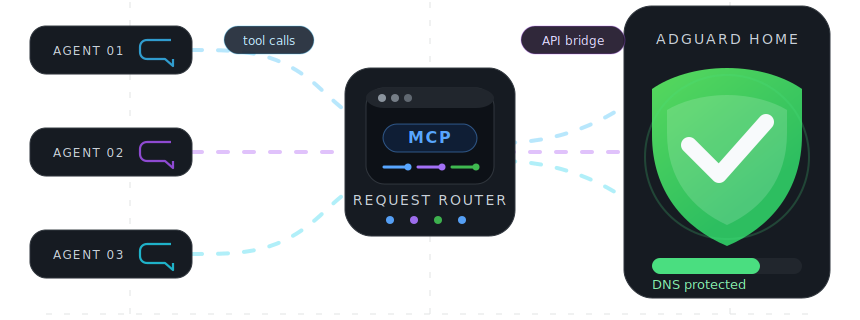

# 🛡️ AdGuard Home MCP

A [Model Context Protocol](https://modelcontextprotocol.io/introduction) (MCP) server for [AdGuard Home](https://adguard.com/en/adguard-home/overview.html). Manage DNS rewrite records, filtering rules, and filter lists via AI agents.

[](https://www.npmjs.com/package/@fcannizzaro/mcp-adguard-home)
[](https://github.com/fcannizzaro/mcp-adguard-home/actions/workflows/publish-package.yaml)



## 📦 Installation

```bash
npm i -g @fcannizzaro/mcp-adguard-home
```

## ⚙️ Credentials

For the CLI, run:

```bash
adguard-cli login
```

This prompts for your AdGuard Home URL, username, and password, then saves them to `~/.config/mcp-adguard-home/config.json`. Saved credentials are loaded automatically on start. If no saved credentials are available, the package falls back to these environment variables:

| Variable           | Description                                                        |
| ------------------ | ------------------------------------------------------------------ |
| `ADGUARD_URL`      | Base URL of your AdGuard Home instance (e.g. `http://192.168.1.1`) |
| `ADGUARD_USERNAME` | AdGuard Home username                                              |
| `ADGUARD_PASSWORD` | AdGuard Home password                                              |

## 🚀 Configuration

### Claude Desktop

Edit `~/Library/Application Support/Claude/claude_desktop_config.json` (macOS) or `%APPDATA%\Claude\claude_desktop_config.json` (Windows):

```json
{
	"mcpServers": {
		"adguard-home": {
			"command": "npx",
			"args": ["-y", "@fcannizzaro/mcp-adguard-home"],
			"env": {
				"ADGUARD_URL": "http://192.168.1.1",
				"ADGUARD_USERNAME": "admin",
				"ADGUARD_PASSWORD": "your-password"
			}
		}
	}
}
```

### Cursor

Edit `.cursor/mcp.json` in your project root (or `~/.cursor/mcp.json` globally):

```json
{
	"mcpServers": {
		"adguard-home": {
			"command": "npx",
			"args": ["-y", "@fcannizzaro/mcp-adguard-home"],
			"env": {
				"ADGUARD_URL": "http://192.168.1.1",
				"ADGUARD_USERNAME": "admin",
				"ADGUARD_PASSWORD": "your-password"
			}
		}
	}
}
```

### VS Code

Edit `.vscode/mcp.json` in your project root:

```json
{
	"servers": {
		"adguard-home": {
			"type": "stdio",
			"command": "npx",
			"args": ["-y", "@fcannizzaro/mcp-adguard-home"],
			"env": {
				"ADGUARD_URL": "http://192.168.1.1",
				"ADGUARD_USERNAME": "admin",
				"ADGUARD_PASSWORD": "your-password"
			}
		}
	}
}
```

### Windsurf

Edit `~/.codeium/windsurf/mcp_config.json`:

```json
{
	"mcpServers": {
		"adguard-home": {
			"command": "npx",
			"args": ["-y", "@fcannizzaro/mcp-adguard-home"],
			"env": {
				"ADGUARD_URL": "http://192.168.1.1",
				"ADGUARD_USERNAME": "admin",
				"ADGUARD_PASSWORD": "your-password"
			}
		}
	}
}
```

### Claude Code CLI

```bash
claude mcp add adguard-home \
  -e ADGUARD_URL=http://192.168.1.1 \
  -e ADGUARD_USERNAME=admin \
  -e ADGUARD_PASSWORD=your-password \
  -- npx -y @fcannizzaro/mcp-adguard-home
```

## 🧰 Available Tools

The package also installs a regular CLI for agents or scripts that do not use MCP:

```bash
adguard-cli login
adguard-cli list_rewrite_dns_records
adguard-cli add_rewrite_dns_record --domain example.test --ip 192.168.1.10
adguard-cli manage_dns_filtering_rules --domains ads.example --allowed false
```

CLI arguments can also be passed as a JSON object:

```bash
adguard-cli add_rewrite_dns_record '{"domain":"example.test","ip":"192.168.1.10"}'
```

### DNS Rewrite Records

| Tool                        | Description                  | Parameters                     |
| --------------------------- | ---------------------------- | ------------------------------ |
| `list_rewrite_dns_records`  | List all DNS rewrite records | —                              |
| `add_rewrite_dns_record`    | Add a DNS rewrite record     | `domain: string`, `ip: string` |
| `remove_rewrite_dns_record` | Remove a DNS rewrite record  | `domain: string`, `ip: string` |

### DNS Filtering Rules

| Tool                          | Description                         | Parameters                              |
| ----------------------------- | ----------------------------------- | --------------------------------------- |
| `list_dns_filtering_rules`    | List all custom DNS filtering rules | —                                       |
| `manage_dns_filtering_rules`  | Block or allow domains              | `domains: string[]`, `allowed: boolean` |
| `remove_rdns_filtering_rules` | Remove custom filtering rules       | `domains: string[]`                     |

### Filter Lists

| Tool                   | Description                      | Parameters                       |
| ---------------------- | -------------------------------- | -------------------------------- |
| `list_filter_lists`    | List all configured filter lists | —                                |
| `toggle_filter_list`   | Enable or disable a filter list  | `id: number`, `enabled: boolean` |
| `refresh_filter_lists` | Force update of all filter lists | —                                |

## 📄 License

Licensed under the [MIT License](LICENSE).
